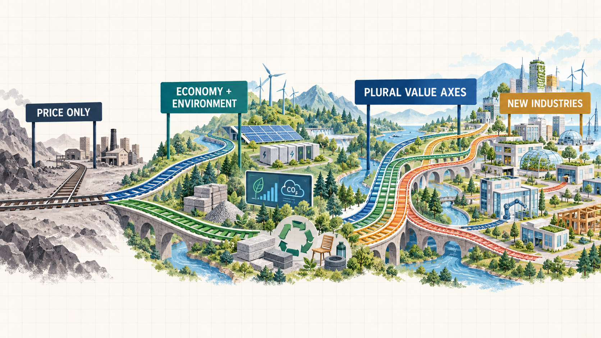

# 1. How Value Axes Create New Industries

Value Decentralization does not begin with an attempt to make evaluation slightly fairer.

Its deeper hypothesis is that **when a value previously left outside the market gains an independent metric, evidence base, rule, and source of capital, new markets and industries can form around delivering that value.**

Markets do not automatically recognize everything society considers important. They optimize most strongly for values that have been measured and connected to contracts, procurement, investment, regulation, or rewards.

## 1.1 Markets optimize what receives capital

A value may be socially important yet remain economically invisible when:

- no one has defined what improvement means;
- no credible measurement method exists;
- third parties cannot verify the outcome;
- achieving the outcome does not affect purchasing, investment, or rewards; or
- the value is absorbed into a composite score and never becomes an independent source of demand.

Under those conditions, companies, engineers, evaluators, standards, and supply chains dedicated to that value struggle to emerge.

The reverse is also true. When a value becomes measurable, evidence becomes available, and an independent budget or source of demand is attached to it, organizations can compete to deliver it. The market begins to produce more than rankings of existing companies: it creates new products, specialists, research fields, standards, and industries.


**The central market-formation thesis**

Measurement alone does not create an industry. A value becomes an industry when it is verifiable and connected to independent demand for capital.


## 1.2 Economic value and environmental value

Environmental value has always mattered. Yet for long periods, many markets centered on economic measures such as price, output, revenue, and profit, while pollution, waste, resource depletion, and greenhouse-gas emissions remained outside the transaction price.

Under such conditions, a company could reduce environmental harm without receiving independent demand or compensation for the improvement. If procurement still selected exclusively on price, environmental improvement did not become a competitive advantage.

The change did not come merely from declaring that the environment matters. It came from building institutions that could:

- measure emissions, energy efficiency, renewable share, recycled content, and related outcomes;
- establish minimum environmental standards as constraints;
- connect procurement, subsidies, investment, regulation, and disclosure to those measurements;
- audit and certify improvements; and
- direct independent capital toward environmental performance.

This made a design space visible that economic value alone could not express.



## 1.3 Two independent values expand the design space

When price is the only axis, the dominant direction of competition is to become cheaper.

When economic and environmental value remain independent, several directions can coexist:

- low cost and low environmental impact;
- higher initial cost but longer life and less waste;
- lower operating expense and lower emissions through energy efficiency;
- greater use of local resources and shorter transport distances;
- repair, reuse, and remanufacturing by design; and
- low emissions with a different set of resource constraints.

The important step is not to collapse everything back into one “environmental performance score.” Independent outcomes allow different technological approaches to remain visible while still showing which values each approach advances.

## 1.4 Industries that formed around environmental value

When environmental value became connected to measurement, verification, and capital allocation, specialization emerged not only in products and energy sources but also in the surrounding infrastructure.

| Independent value | Evidence and rule | Specialized markets and industries |
| --- | --- | --- |
| Low-carbon energy | emissions intensity, renewable share | renewable generation, grid integration, energy storage |
| Emissions visibility | organizational and product footprints | carbon accounting, reporting, verification |
| Low-carbon materials | embodied carbon, lifecycle evidence | alternative materials, green procurement, material certification |
| Resource circulation | repairability, recycled content, recovery rate | reuse, repair, remanufacturing, recycling technology |
| Environmental performance | standards, labels, audit records | certification, environmental auditing, data infrastructure |
| Fundable transition | taxonomies, eligibility rules, impact evidence | green finance, transition finance, impact investment |

One independent value axis creates more than new products. It creates demand for people who define, measure, verify, improve, fund, and maintain that value. That ecosystem is what becomes an industry.

## 1.5 What are the next environmental values?

If separating environmental value from economic value helped new markets grow, other values currently hidden inside composite scores may also be able to develop independent markets.

| Existing dominant value | Independent value | Possible new design space |
| --- | --- | --- |
| Lowest cost | Resilience | distributed supply, regional manufacturing, redundant infrastructure |
| Fastest service | Regional fairness | rural logistics, last-mile access |
| Maximum convenience | Privacy | privacy-preserving identity, local computation |
| Maximum productivity | Worker stability | income floors, cooperative dispatch, portable benefits |
| Maximum energy efficiency | Household protection | protected flexibility, community energy |
| Global scale | Local autonomy | local finance, community infrastructure, regional governance |
| Short-term performance | Maintainability | repair economies, long-life software, maintenance markets |

Value Decentralization does not select one of these as the correct value for everyone. It aims to let different communities and funders publish their own values, rules, contexts, and budgets as independent Value Pools.

## 1.6 From value to industry

We describe the formation of a new industry as the following chain:

```text
VALUE TENSION
        ↓
INDEPENDENT VALUE AXIS
        ↓
METRIC + HARD CONSTRAINT
        ↓
SHARED EVIDENCE
        ↓
INDEPENDENT CAPITAL
        ↓
SPECIALIZED ARTIFACTS
        ↓
NEW MARKET
        ↓
NEW INDUSTRY
```

If any link is missing, the value may remain an aspiration rather than becoming a market.

- A metric without safeguards can produce Goodhart effects or superficial compliance.
- Without evidence, improvement cannot be verified.
- Without capital, sustained supply does not emerge.
- Without multiple artifacts, there is no meaningful market.
- If everything is recombined into one score, the newly independent value can disappear again.

## 1.7 What the current demonstration means

The 72-Hour Disaster Response demonstration does not claim to have created a disaster-response industry. It shows, within a small simulation, that attaching separate pools of capital to resilience, efficiency, fairness, and frontier expansion allows different strategies to receive support from the same body of evidence.

It is not the final form of Value Decentralization. It is the first demonstration of a market-formation hypothesis: **when values have independent demand, different solution families can survive and improve at the same time.**
