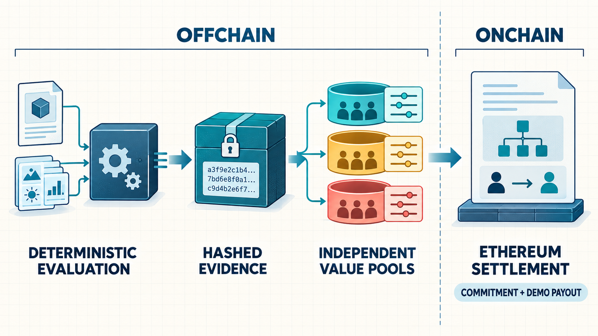

# 5. Ethereum and the Evidence Boundary

Ethereum is not the evaluator in Value Decentralization. The blockchain does not make an offchain calculation correct by itself. Its role is to make the selected result and final allocation difficult to rewrite after the fact, while allowing anyone to inspect the reward event.



## 5.1 Why evaluation is offchain

Arena-specific evaluation may require simulating seven disaster scenarios, compiling Solidity, or executing EVM runtime bytecode. Performing every step onchain would be expensive and would make it difficult to adapt the system to new problem shapes.

To preserve reproducibility while computing offchain, the system versions its inputs, datasets, constraints, metrics, evaluator, and outcomes, and links them through hashes.

## 5.2 Why settlement is on Ethereum

| Offchain | Onchain |
| --- | --- |
| Artifact intake | Allocation commitment |
| Constraint checks | Reward-pool balance constraints |
| Scenario evaluation | One commitment per challenge |
| Outcome Vector | Prevention of duplicate rewards to the same wallet for the same challenge |
| Pareto and Contribution calculation | RewardPaid event |
| Allocation calculation for each Value Pool | Individual claim path for participants skipped during batch distribution |

Ethereum protects the commitment and payment boundary outside the evaluator.

## 5.3 Evidence Chain

```text
dataset + evaluator + constraints + metrics
                    → context hash

context hash + artifact + measurements
                    → result hash

final results + value-pool calculations
                    → allocation root

allocation root + reward transfer
                    → Sepolia transactions and events
```

Changing the dataset, constraints, metrics, or evaluator settings changes the Context Hash. Changing an outcome or allocation changes the corresponding Result or Allocation Evidence.

## 5.4 Current Reward Demonstration

The current settlement demonstration uses two primary contracts.

| Contract | Current role |
| --- | --- |
| `FrontierRewardPool` | Allocation commitment, distribution, and individual claims |
| `FrontierDemoToken` | Demonstration token on Sepolia |

“Frontier” in these contract identifiers is a historical implementation name, not the name of the product.

Public evidence:

- [Allocation commitment](https://sepolia.etherscan.io/tx/0x96fd7a9d1f4a3bbd2fa7a9ea28d250a16e8eedbaff05b51a4f33e581c3839f2c)
- [RewardPaid transaction](https://sepolia.etherscan.io/tx/0xd976a968aefeb66d7e60fba7a9cf64c8711195fc3652aeccc20c7448069ad708)

In this demonstration, the recipient balance increased by 10,000 FDT. FDT is a Sepolia demonstration token and carries no claim of monetary value.


The public evaluators and Sepolia reward demonstration both have real evidence, but they are not yet integrated into a complete production tournament.


## 5.5 Design explorations for Ethereum engineering

The shared vocabulary of Value Decentralization could also be applied to the following technical domains. These are research directions, not a list of currently implemented arenas.

| Domain | Independent outcomes | Hard Constraint |
| --- | --- | --- |
| Home Proving | proving latency, energy, hardware cost | proof validity, security |
| Post-Quantum Authentication | verification gas, signature bytes | post-quantum security, replay protection |
| Confidential Compute | encrypted latency, state overhead | correctness, privacy |
| Data Availability | throughput, per-node bandwidth | recovery guarantee |
| Verified Optimization | runtime gas, bytecode size, proof cost | formal equivalence |
| Accountable RPC | response latency, privacy overhead | response correctness |

The research question is whether different Value Pools can support these outcomes independently, rather than forcing every engineering goal into one KPI.
