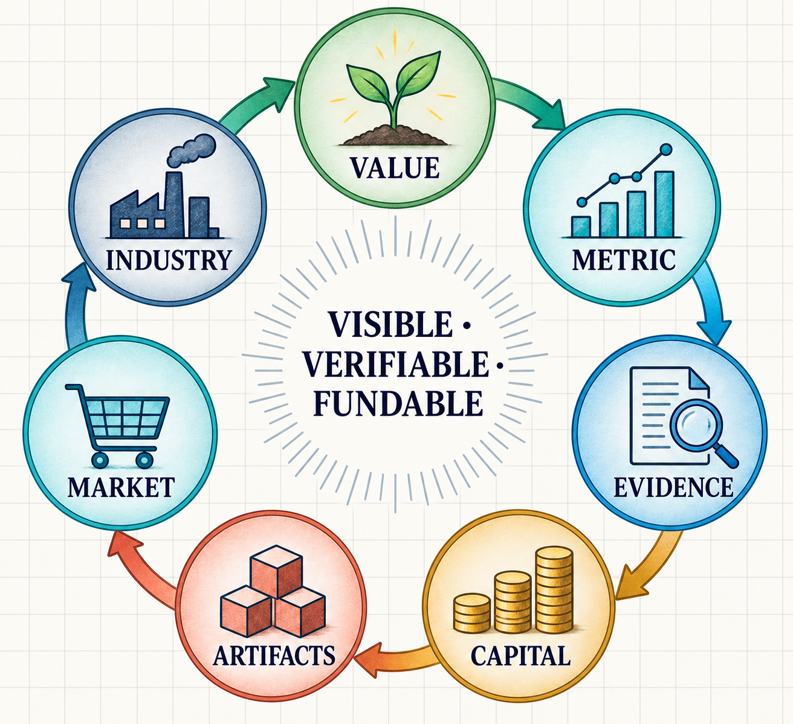

# 10. Research Agenda and Manifesto

## 10.1 Research Agenda

Value Decentralization is not complete when a single score is replaced by a Pareto Frontier. The entire process of discovering, measuring, verifying, funding, and sustaining a value as a market remains a research problem.

| Research question | Core question |
| --- | --- |
| Value Discovery | Whose voices reveal values that do not yet have markets? |
| Value Independence | Which values should be independent axes, and which should be Hard Constraints? |
| Metric Validity | Does a metric actually represent the value it is meant to protect? |
| Hard Constraints | What must never be traded against price or performance? |
| Context Dependence | How far can an outcome be transferred across regions or time periods? |
| Bounds and Normalization | Who selects hypervolume bounds, and on what basis? |
| Capital Formation | What turns a temporary pool into recurring demand? |
| Value Pool Governance | Who may create, change, or close a pool? |
| Reward Allocation | How can different pools avoid being recombined into a master score? |
| Metric Gaming | How should Goodhart effects, overfitting, and hidden externalities be detected? |
| Reproducibility | What conditions are required to claim independent reproduction? |
| Rights as Constraints | How should rights, safety, and minimum protections be represented and audited? |
| Institutional Separation | How can concentration among funders, evaluators, and Context Authors be prevented? |
| Industry Formation | At what point do value, evidence, and capital become a new industry? |
| Long-term Maintenance | How should obsolete artifacts, rules, and evidence be tracked? |

## 10.2 Value-to-Industry Flywheel

Value Decentralization is not about adding important values to a list. It is about creating a cycle in which sustained supply and learning can develop around those values.

<figure><figcaption><p>Value-to-industry flywheel</p></figcaption></figure>

### Value

Identify a value that current markets or institutions do not adequately support: resilience, privacy, regional fairness, worker stability, maintainability, or another overlooked outcome.

### Metric

Translate the value into an observable outcome. At the same time, separate rights and minimum protections that must not be reduced to numerical tradeoffs.

### Evidence

Publish the dataset, context, evaluator, outcomes, and reproduction procedure so that improvements can be inspected and challenged.

### Capital

A Value Pool publishes a value statement, rule, and budget, creating independent demand for that outcome. This is the point at which delivering the value becomes an economic activity.

### Artifacts

Different builders create technologies, strategies, institutional rules, and services. Instead of selecting one global winner, the system preserves artifacts with different value compositions.

### Market

As demand for the same value recurs, shared comparison methods, contracts, standards, specialists, and supply chains begin to form.

### Industry

The system moves beyond one temporary challenge. Persistent employment, research, companies, professions, education, standards, and infrastructure emerge. The new industry produces new evidence and reveals new Value Tensions, renewing the cycle.


**VISIBLE · VERIFIABLE · FUNDABLE**

When a value becomes visible, verifiable, and independently fundable, an industry can form around delivering it.


## 10.3 Manifesto

### I. Markets optimize what receives capital

Markets do not automatically protect everything society values. They optimize most strongly for outcomes connected to measurement, contracts, and capital.

### II. One score is a political choice

Reducing several outcomes to one number is not a neutral calculation. It encodes the values of whoever selected the weights.

### III. Shared evidence does not require shared values

Datasets, constraints, outcomes, and hashes can be shared. What deserves support does not need to be unified.

### IV. No pool speaks for everyone

One Value Pool represents one value statement. It must not become a Global Winner or Master Pool that claims to represent all other pools.

### V. Pareto is a safeguard, not a sovereign

The Pareto Frontier helps avoid discarding valid alternatives too early. The frontier itself does not possess social legitimacy.

### VI. Rights are not a tradable metric

Fundamental rights, safety, minimum protections, and appeals must not become ordinary outcomes traded against efficiency or rewards.

### VII. Unmeasured values still exist

A value does not cease to exist because it is unmeasured. Every metric is incomplete, and its limitations and revision history must remain public.

### VIII. Verification and legitimacy are different

Hashes and blockchains help detect rewriting and verify payments. They do not automatically prove that a metric is socially valid or an institution legitimate.

### IX. New values can create new industries

The purpose of making a value independent is not to add another column to an evaluation table. It is to create demand from which technologies, organizations, professions, and markets dedicated to that value can grow.

### X. Plural institutions should remain forkable

Another community must be able to create a different context, constraint set, and Value Pool. No single operator should control the entrance through which values become fundable.

## 10.4 Long-Term Vision

### 10.4.1 Beyond Better Competitions

Value Decentralization is not ultimately about improving the scoring of competitions or grants.

A competition is the smallest unit in which a much larger hypothesis can be tested:

> When different values receive independent capital, different kinds of solutions can survive around the same problem—and markets can form around improving each of them.

In the 72-Hour Disaster Response demonstration, Resilience Mesh, Budget Sprint, and Fair Reach receive support from different Value Pools using the same seven-scenario evidence. This is both a small allocation demo and a model of market formation: different forms of demand sustain different solution families.

Today, the system uses demo credits and a demonstration payout on Sepolia. The long-term question is whether this structure can become recurring demand.

### 10.4.2 From Value Pool to Industry

One Value Pool is only one grant. When capital repeatedly supports the same value and its evidence and rules become standardized, the structure of a market begins to form.

```text
ONE VALUE POOL
      ↓
REPEATED DEMAND
      ↓
SPECIALIZED ARTIFACTS
      ↓
SPECIALIZED BUILDERS
      ↓
EVALUATORS + STANDARDS
      ↓
SUPPLY CHAINS + ADOPTION
      ↓
NEW INDUSTRY
```

A new industry does not emerge from one winning artifact. It requires multiple buyers, differentiated demand, room for improvement, reusable evidence, and specialized suppliers.

A Value Pool is an institutional seed for creating the first demand around a value that does not yet have a market price.

### 10.4.3 Values That Could Become the Next Environmental Axis

As environmental value helped specialized markets grow around renewable energy, storage, carbon accounting, certification, circular design, and green finance, other independent values may also create new industries.

| Independent value | Current tension | Industries that may emerge |
| --- | --- | --- |
| Resilience | conflicts with short-term cost | distributed supply, regional manufacturing, disaster logistics, redundant infrastructure |
| Privacy | conflicts with convenience and data aggregation | privacy-preserving identity, zero-knowledge services, local inference, confidential computation |
| Regional Fairness | conflicts with average efficiency | rural logistics, last-mile infrastructure, regional service design |
| Worker Stability | conflicts with maximum utilization | cooperative dispatch, income-floor systems, portable-benefits infrastructure |
| Accessibility | conflicts with standardized mass design | assistive technology, inclusive interfaces, accessible infrastructure |
| Maintainability | conflicts with short-term performance | repair economies, long-life software, maintenance and verification services |
| Community Autonomy | conflicts with global scale | local energy, community finance, participatory infrastructure |
| Biodiversity | conflicts with immediate land productivity | habitat monitoring, restoration services, nature-positive supply design |

The purpose is not to tokenize every value or reduce every value to one price.

It is to let different values develop their own evidence, rules, capital, and suppliers.

### 10.4.4 Roles around new industries

Environmental industries created demand for measurement, auditing, certification, and finance in addition to energy and physical products. Industries emerging through Value Decentralization would also require surrounding infrastructure.

- people who discover values and map tensions;
- people who design metrics and Hard Constraints;
- people who maintain datasets and contexts;
- Independent Evaluators who reproduce outcomes;
- reviewers who audit rights and negative externalities;
- funders and communities who design and operate Value Pools;
- builders who create new artifacts;
- adopters who deploy them in real contexts;
- challengers who discover failure and gaming; and
- researchers who organize evidence across contexts.

If Value Decentralization becomes an industry, it should not take the form of one application growing into a universal authority. Different markets and roles should branch around different values and remain connected through interoperable evidence.

### 10.4.5 Decentralizing capital allocation

Blockchains made ownership, transfer, and settlement more open. Yet the question of what counts as progress—and which improvements receive capital—can remain concentrated in a small number of leaderboards, grant committees, procurement scores, and investment models.

Value Decentralization addresses this quieter concentration:

- Who selects the metrics?
- Who chooses the weights?
- Whose values remain externalities?
- Which improvements become recognized as market demand?
- Who is allowed to create another Value Pool?

Decentralizing asset ownership is insufficient when the definition of value remains singular. The long-term scope of Value Decentralization is to pluralize the entrance through which value judgments become capital allocation.

### 10.4.6 No Universal Moral Oracle

Value Decentralization does not attempt to build a Universal Oracle that decides the correct values for society.

Words such as resilience, fairness, privacy, and environment each admit multiple definitions. That is why the Value Statement, metrics, constraints, context, funder, budget, and revision history must be public.

Another community must be able to apply a different rule to the same evidence. At the same time, rights and safety cannot be made tradable merely by calling them differences in values; Hard Constraints and rights review remain necessary.

### 10.4.7 The world this work aims to create

A region may one day maintain a dedicated budget for a supply chain that continues operating during disaster, rather than selecting only the cheapest supply chain.

A city may fund access in its least-served neighborhoods independently from average travel time.

A worker community may attach capital to income stability and safety rather than measuring delivery speed alone.

A group of users may create recurring demand for technologies that protect privacy rather than optimizing only for convenience.

If those forms of demand persist, companies, researchers, evaluators, standards, and supply chains can emerge around delivering each value.

Value Decentralization does not ultimately aim to produce one better winner. **It aims to create a world in which values that do not yet have markets can create markets and industries of their own.**


**Final Definition**

Value Decentralization is a design philosophy and experiment for preventing any one actor from selecting the single correct value; enabling multiple value judgments, rules, sources of capital, and executable alternatives to coexist over Shared Evidence; and creating the conditions in which values without markets can give rise to new industries.

