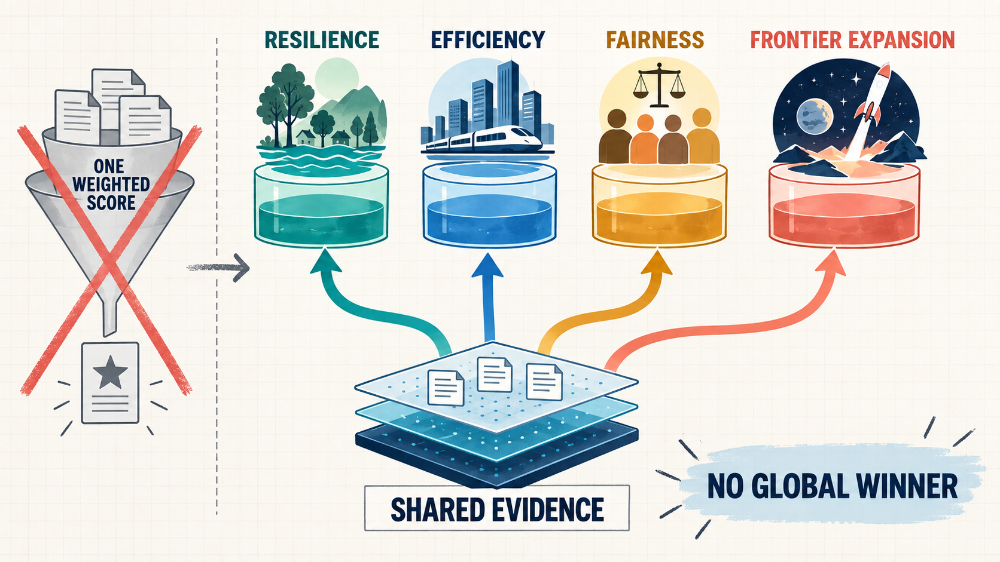

# Value Decentralization

## Independent Values Can Create New Markets and Industries

**Whitepaper / Research Record / Technical Reference**  
From Independent Values to New Markets and Industries

> We can share the same evidence without agreeing on a single definition of what deserves support.


**Purpose of this document**

This whitepaper is not a walkthrough of the demo. It records where the idea of Value Decentralization comes from, how far it has been implemented, and which parts remain future research. The later sections serve as a technical appendix for inspecting the mathematics, schemas, hashes, evaluators, and public Ethereum evidence behind the claims.


<figure><figcaption>
Shared evidence and independent value pools
</figcaption></figure>

## Definition

**Value Decentralization is a design philosophy for preventing judgments about what matters from being concentrated in one score, one funder, or one rule. It also makes overlooked values measurable, verifiable, and fundable so that new markets and industries can form around them.**

Different actors can refer to the same verifiable evidence while independently funding resilience, efficiency, fairness, frontier expansion, or other values through separate Value Pools. The system does not require an overall score or a global winner.

## Conceptual map

| Concept | Meaning in this document |
| --- | --- |
| Value Decentralization | The product, thesis, and research field as a whole |
| Shared Evidence | Verifiable results that multiple value judgments can reference |
| Value Pool | A value statement, rule, context, and budget published by one funder or community |
| Pareto Frontier | An analytical method that preserves non-dominated alternatives without compressing their outcomes into one score |
| Frontier Contribution | One allocation rule that a Value Pool may choose |
| Ethereum | Infrastructure for making final commitments and payments publicly verifiable |


**Naming**

The product is named **Value Decentralization**. “Frontier” refers only to concepts such as Pareto analysis and the boundary of the currently achievable outcome space; it is not the name of the product as a whole.


## Evidence-state vocabulary

| State | What it permits us to claim |
| --- | --- |
| `measured` | A deterministic evaluator produced a result |
| `simulated` | A non-live boundary was modeled and explicitly labeled |
| `committed` | A result or allocation has corresponding onchain evidence |
| `paid` | A transfer, event, and recipient record can be verified |
| `Practice` | The measurement is real, but the production tournament layer is incomplete |

One state must never be inferred from another. A successful simulation is not production evidence, and a Sepolia payment does not mean that a production tournament has been completed.

## How to use this whitepaper

- Market-formation thesis: [How Value Axes Create New Industries](01-origin.md) → [Definition and Shared Language](02-definition-and-language.md)
- Institutional design: [Shared Evidence, Value Pools, and Pareto](03-pareto-and-market.md)
- What works today: [Current Demonstrations](04-evm-frontier-market.md) → [Ethereum and the Evidence Boundary](05-ethereum-ecosystem.md)
- Social extension: [Design Changes for Social Domains](06-social-transition.md) → [Social Design Explorations](07-social-frontiers.md)
- Safety and future development: [Evidence and Rights](08-evidence-and-rights.md) → [Ecosystem and Roadmap](09-protocol-and-roadmap.md)
- Philosophical conclusion: [Research Agenda and Manifesto](10-research-and-manifesto.md)
- Verification reference: [Technical Appendix](appendix.md)

## Current public evidence

- [Live application](https://web-rho-seven-d6te7t3f0y.vercel.app)
- [Sepolia allocation commitment](https://sepolia.etherscan.io/tx/0x96fd7a9d1f4a3bbd2fa7a9ea28d250a16e8eedbaff05b51a4f33e581c3839f2c)
- [Sepolia RewardPaid transaction](https://sepolia.etherscan.io/tx/0xd976a968aefeb66d7e60fba7a9cf64c8711195fc3652aeccc20c7448069ad708)

---

Version 1.0 / 2026-09-09
